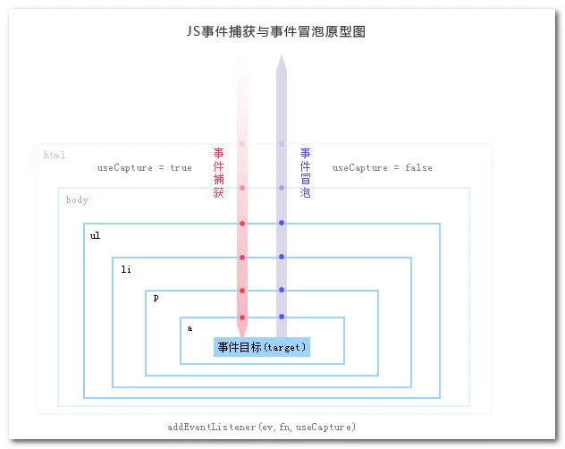

# DOM event mechanism

## What is dom event model? What exactly happens when an event occurs?

When an event occurs, it propagates between the child elements and the parent elements in three steps:

1. Capture phase
2. Target phase
3. bubbling phase

When we listen for an event with 'addEventListener', we can specify the event to be executed in the capture or bubbling phase by setting the third parameter, as shown in the figure:



## DOM event handling model

What we just talked about belongs to the **Dom level 2** event model, which listens for events in the capture/bubbling phase through the 'addEventListener'. There is also a DOM level 0 event model

### level 0

on + eventName. onclick, onblur ...

- The same event can only register one callback, the later will overwrite the previous
- If you want to unbind, directly register as null can be executed
- Executed in target phase or bubbling phase

```html
<body>
  <button type="button" onclick="fn()" id="btn1">
    register callback by html
  </button>
  <button type="button" id="btn2">register callback by js</button>
</body>

<script>
  // dom 0 level event model
  function fn() {
    alert('Hello World 1')
  }
  // on + eventName
  let btn2 = document.getElementById('btn2')
  btn2.onclick = function () {
    alert('Hello World 2')
  }
  btn2.onclick = function () {
    alert('I was executed but not Hello World 2')
  }
  // unbind
  btn2.onclick = null
</script>
```
